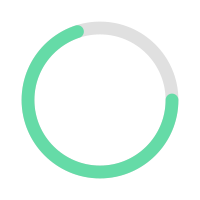
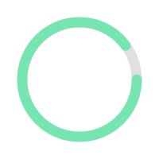

  

## <picture></picture> Sobre mi

🎓 **Técnico en Sistemas** con formación sólida en mantenimiento preventivo, correctivo y soporte técnico.  
💻 Actualmente curso el **Tecnólogo en Análisis y Desarrollo de Software (ADSO)** en el **SENA**,  
en simultáneo con **Ingeniería de Sistemas** en la **Universidad de Pamplona**.  

💡 Me apasiona la tecnología, la programación y el desarrollo de soluciones innovadoras que aporten valor real.  
🚀 Mi meta es convertirme en **desarrollador full stack**, ampliar mi conocimiento en **bases de datos** y explorar nuevas oportunidades en Inteligencia Artificial y desarrollo tecnológico.

  

   &nbsp;&nbsp;&nbsp;&nbsp;&nbsp;
  

  <strong>👨‍🎓 Ingeniería de Sistemas</strong> &nbsp;&nbsp;&nbsp;&nbsp;&nbsp;&nbsp;&nbsp;&nbsp;&nbsp;&nbsp;&nbsp;
  <strong>👨‍💻 Tecnólogo en ADSO</strong>

## <picture></picture> Tecnologías y herramientas

### 🧑‍💻 Frontend

  

### ⚙️ Backend

  

### 🛠️ Herramientas y despliegue

  
  
  
  

  <table border="0" cellpadding="10" cellspacing="0" style="border-collapse: collapse;">
    <tr valign="top">
      <td>
        
      </td>
      <td>
        
      </td>
    </tr>
  </table>

